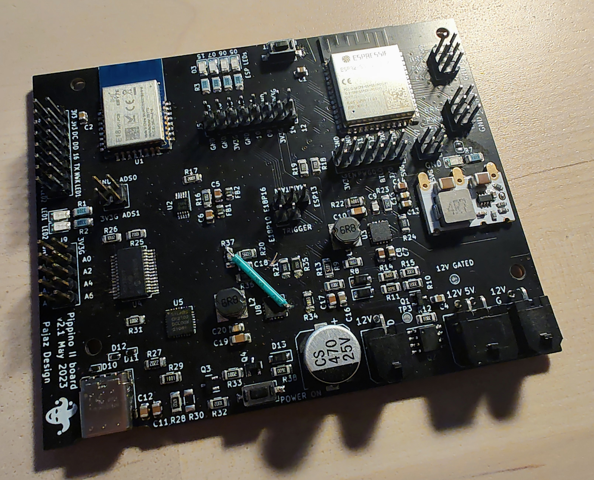

# Pippino II control PCB v2.1

## Main Features:

### Power supply

The board supports a 12 V power supply (within the range provided by a 3S Li-Ion battery), which is distributed to:
- A completely independent 3.3 V DC-DC converter providing always-on power supply, used to power the on-board E18 ZigBee module.
- A gated 12 V net, that can be switched on via a low on-resistance AO4409 MOSFET

The 12 V net, subsequently, provides power to:
- 4A, 5 V DC-DC converter used to output power to an external SBC (e.g. a Jetson Nano)
- 12 V output connector, to supply external peripherals, such as an USB splitter
- on board 3.3 V DC-DC converter, used to power the on-board ESP32-S3 microcontroller

### Always-on, low-power ZigBee module

The board includes an always-on ZigBee module, enabling the robot to be woken up via ZigBee/Home automation
while consuming low power (~10mA) when the system is powered off.
The ZigBee module can be programmed to perform more complex actions if required (GPIO pins exposed with a connector).

### ESP32-S3 microcontroller

The board includes an ESP32-S3 microcontroller with BT/WiFi capability. The ESP32 can be programmed via the USB3 connector,
which is intended to be always connected to the SBC.
OTA programming is then not required, as the SBC can be used to reprogram the ESP32 at any time.

The ESP32 is used to control the main driving motors for the robot, as well as receive information from sensors etc.

### Peripherals

The board includes:
- an ADC chip, connected via I2C to the MCU
- smart DC-DC converters (TPS62110) with low battery voltage flagging capability (connected to a pin of the MCU)
- CP2102N USB to serial converter (for communication with the MCU)
